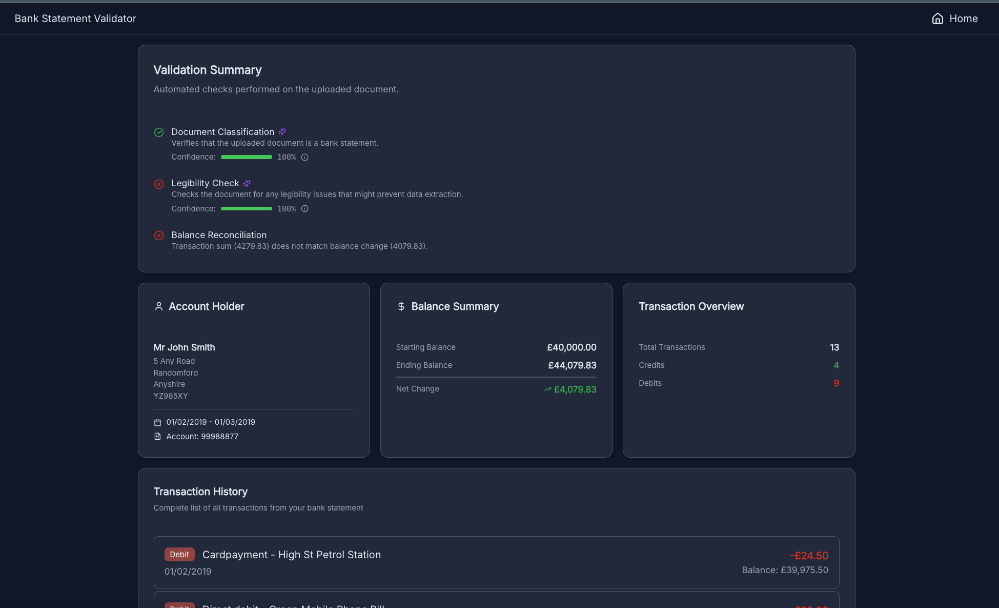
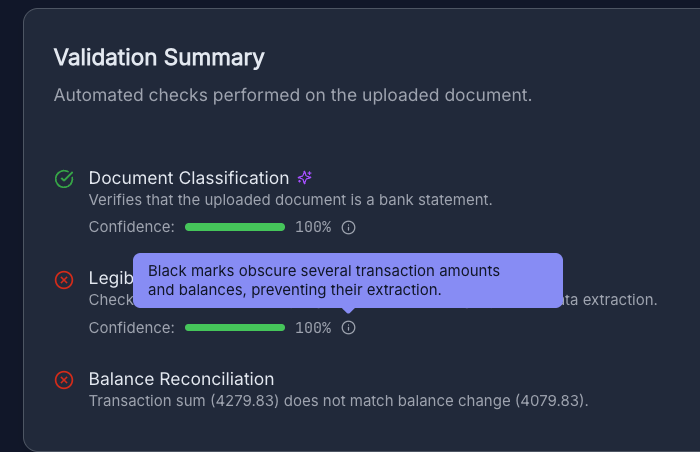
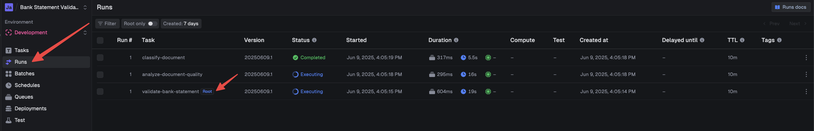
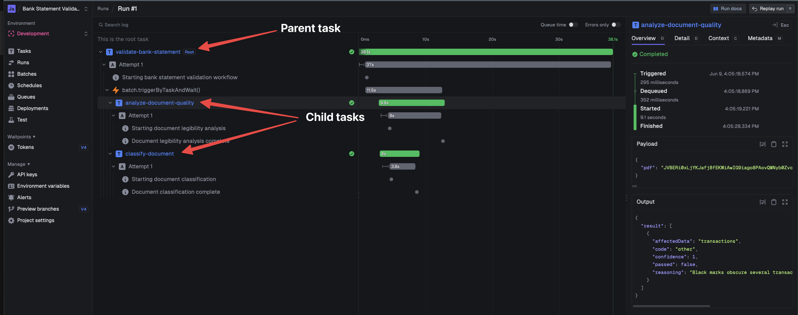

# bank-statement-validator

An AI-powered tool that validates bank statements with explainable artificial intelligence.



## Overview

This application analyzes uploaded bank statement documents through multiple validation stages:

**AI Validations**

- Document classification (is it actually a bank statement?)
- Quality analysis (can key data be extracted?)
- Data extraction from the statement

**Calculated Validations**

- Balance reconciliation (do transactions add up correctly?)

**Explainable AI Features**

- Confidence scores for all AI decisions
- Reasoning explaining each validation result
- Visual indicators showing AI vs calculated validations



## Tech Stack

- [Next.js](https://nextjs.org/)
- [Supabase](https://supabase.com/) - s3 storage, postgres database
- [Vercel AI SDK](https://ai-sdk.dev/)
- [trigger.dev](https://trigger.dev/) - workflow orchestration
- [Prisma](https://www.prisma.io/) - database ORM and state based schema with migration generation

## Setup

Install dependencies

```bash
pnpm install
```

Start supabase (with docker running)

```bash
pnpx supabase start
```

Copy the `.env.example` file to `.env` and fill in the values.

```bash
cp .env.example .env
```

To get the .env values with `get-from-supabase-status`

```bash
pnpx supabase status
```

Create a [trigger.dev account](https://cloud.trigger.dev/) if you don't have one.
If you are not in the trigger project (would need an invitation) you will need to create a new project and change the project id in the `trigger.config.ts` file.

[Create a development API key](https://trigger.dev/docs/apikeys) and set it in the `.env` file.

```bash
TRIGGER_API_KEY=your-trigger-api-key
```

Start the development server

```bash
pnpm dev
```

### Viewing runs in the trigger dashboard

You can view the runs in the trigger dashboard.
Start a pdf analysis in the app and then in the trigger dashboard press the Runs button in the sidebar and then press the task with the root tag.




